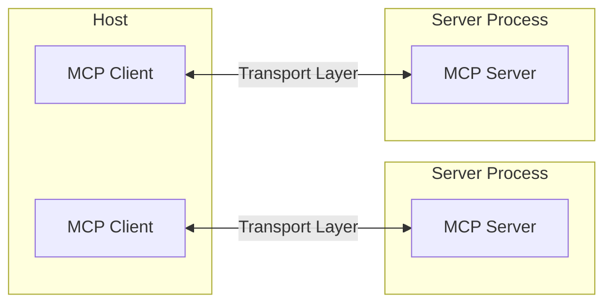

# Core architecture

> Understand how MCP connects clients, servers, and LLMs

MCP follows a client-server architecture where:

* **Hosts** are LLM applications (like Claude Desktop or IDEs) that initiate connections
* **Clients** maintain 1:1 connections with servers, inside the host application
* **Servers** provide context, tools, and prompts to clients



## Core components

### Transport layer

The transport layer handles the actual communication between clients and servers. MCP supports multiple transport mechanisms:

1. **Stdio transport**
   * Uses standard input/output for communication
   * Ideal for local processes

2. **HTTP with SSE transport**
   * Uses Server-Sent Events for server-to-client messages
   * HTTP POST for client-to-server messages

All transports use [JSON-RPC](https://www.jsonrpc.org/) 2.0 to exchange messages. See the [specification](/specification/) for detailed information about the Model Context Protocol message format.

## Error handling

MCP defines these standard error codes:

```typescript
enum ErrorCode {
  // Standard JSON-RPC error codes
  ParseError = -32700,
  InvalidRequest = -32600,
  MethodNotFound = -32601,
  InvalidParams = -32602,
  InternalError = -32603
}
```

## Implementation example

Here's a basic example of implementing an MCP server:
```python
import asyncio
import mcp.types as types
from mcp.server import Server
from mcp.server.stdio import stdio_server

app = Server("example-server")

@app.list_resources()
async def list_resources() -> list[types.Resource]:
    return [
        types.Resource(
            uri="example://resource",
            name="Example Resource"
        )
    ]

async def main():
    async with stdio_server() as streams:
        await app.run(
            streams[0],
            streams[1],
            app.create_initialization_options()
        )

if __name__ == "__main__":
    asyncio.run(main())
```

## Best practices

### Transport selection

1. **Local communication**
   * Use stdio transport for local processes
   * Efficient for same-machine communication

2. **Remote communication**
   * Use SSE for scenarios requiring HTTP compatibility

# Prompts

> Create reusable prompt templates and workflows

Prompts enable servers to define reusable prompt templates and workflows that clients can easily surface to users and LLMs. They provide a powerful way to standardize and share common LLM interactions.

<Note>
  Prompts are designed to be **user-controlled**, meaning they are exposed from servers to clients with the intention of the user being able to explicitly select them for use.
</Note>

## Overview

Prompts in MCP are predefined templates that can:

* Accept dynamic arguments
* Include context from resources
* Chain multiple interactions
* Guide specific workflows
* Surface as UI elements (like slash commands)

## Prompt structure

Each prompt is defined with:

```typescript
{
  name: string;              // Unique identifier for the prompt
  description?: string;      // Human-readable description
  arguments?: [              // Optional list of arguments
    {
      name: string;          // Argument identifier
      description?: string;  // Argument description
      required?: boolean;    // Whether argument is required
    }
  ]
}
```

## Discovering prompts

Clients can discover available prompts through the `prompts/list` endpoint:

```typescript
// Request
{
  method: "prompts/list"
}

// Response
{
  prompts: [
    {
      name: "analyze-code",
      description: "Analyze code for potential improvements",
      arguments: [
        {
          name: "language",
          description: "Programming language",
          required: true
        }
      ]
    }
  ]
}
```

## Using prompts

To use a prompt, clients make a `prompts/get` request:

````typescript
// Request
{
  method: "prompts/get",
  params: {
    name: "analyze-code",
    arguments: {
      language: "python"
    }
  }
}

// Response
{
  description: "Analyze Python code for potential improvements",
  messages: [
    {
      role: "user",
      content: {
        type: "text",
        text: "Please analyze the following Python code for potential improvements:\n\n```python\ndef calculate_sum(numbers):\n    total = 0\n    for num in numbers:\n        total = total + num\n    return total\n\nresult = calculate_sum([1, 2, 3, 4, 5])\nprint(result)\n```"
      }
    }
  ]
}
````

## Dynamic prompts

Prompts can be dynamic and include:

### Embedded resource context

```json
{
  "name": "analyze-project",
  "description": "Analyze project logs and code",
  "arguments": [
    {
      "name": "timeframe",
      "description": "Time period to analyze logs",
      "required": true
    },
    {
      "name": "fileUri",
      "description": "URI of code file to review",
      "required": true
    }
  ]
}
```

## Example implementation

```python
from mcp.server import Server
import mcp.types as types

# Define available prompts
PROMPTS = {
    "git-commit": types.Prompt(
        name="git-commit",
        description="Generate a Git commit message",
        arguments=[
            types.PromptArgument(
                name="changes",
                description="Git diff or description of changes",
                required=True
            )
        ],
    ),
    "explain-code": types.Prompt(
        name="explain-code",
        description="Explain how code works",
        arguments=[
            types.PromptArgument(
                name="code",
                description="Code to explain",
                required=True
            ),
            types.PromptArgument(
                name="language",
                description="Programming language",
                required=False
            )
        ],
    )
}

# Initialize server
app = Server("example-prompts-server")

@app.list_prompts()
async def list_prompts() -> list[types.Prompt]:
    return list(PROMPTS.values())

@app.get_prompt()
async def get_prompt(
    name: str, arguments: dict[str, str] | None = None
) -> types.GetPromptResult:
    if name not in PROMPTS:
        raise ValueError(f"Prompt not found: {name}")

    if name == "git-commit":
        changes = arguments.get("changes") if arguments else ""
        return types.GetPromptResult(
            messages=[
                types.PromptMessage(
                    role="user",
                    content=types.TextContent(
                        type="text",
                        text=f"Generate a concise but descriptive commit message "
                        f"for these changes:\n\n{changes}"
                    )
                )
            ]
        )

    if name == "explain-code":
        code = arguments.get("code") if arguments else ""
        language = arguments.get("language", "Unknown") if arguments else "Unknown"
        return types.GetPromptResult(
            messages=[
                types.PromptMessage(
                    role="user",
                    content=types.TextContent(
                        type="text",
                        text=f"Explain how this {language} code works:\n\n{code}"
                    )
                )
            ]
        )

    raise ValueError("Prompt implementation not found")
```

## Best practices

When implementing prompts:

1. Use clear, descriptive prompt names
2. Provide detailed descriptions for prompts and arguments
3. Validate all required arguments
4. Handle missing arguments gracefully
5. Consider versioning for prompt templates
6. Cache dynamic content when appropriate
7. Implement error handling
8. Document expected argument formats
9. Consider prompt composability
10. Test prompts with various inputs

# Resources

> Expose data and content from your servers to LLMs

Resources are a core primitive in the Model Context Protocol (MCP) that allow servers to expose data and content that can be read by clients and used as context for LLM interactions.

<Note>
  Resources are designed to be **application-controlled**, meaning that the client application can decide how and when they should be used.
  Different MCP clients may handle resources differently. For example:

  * Claude Desktop currently requires users to explicitly select resources before they can be used
  * Other clients might automatically select resources based on heuristics
  * Some implementations may even allow the AI model itself to determine which resources to use

  Server authors should be prepared to handle any of these interaction patterns when implementing resource support. In order to expose data to models automatically, server authors should use a **model-controlled** primitive such as [Tools](./tools).
</Note>

## Overview

Resources represent any kind of data that an MCP server wants to make available to clients. This can include:

* File contents
* Database records
* API responses
* Live system data
* Screenshots and images
* Log files
* And more

Each resource is identified by a unique URI and can contain either text or binary data.

## Resource URIs

Resources are identified using URIs that follow this format:

```
[protocol]://[host]/[path]
```

For example:

* `file:///home/user/documents/report.pdf`
* `postgres://database/customers/schema`
* `screen://localhost/display1`

The protocol and path structure is defined by the MCP server implementation. Servers can define their own custom URI schemes.

## Resource types

Resources can contain two types of content:

### Text resources

Text resources contain UTF-8 encoded text data. These are suitable for:

* Source code
* Configuration files
* Log files
* JSON/XML data
* Plain text

### Binary resources

Binary resources contain raw binary data encoded in base64. These are suitable for:

* Images
* PDFs
* Audio files
* Video files
* Other non-text formats

## Resource discovery

Clients can discover available resources through two main methods:

### Direct resources

Servers expose a list of concrete resources via the `resources/list` endpoint. Each resource includes:

```typescript
{
  uri: string;           // Unique identifier for the resource
  name: string;          // Human-readable name
  description?: string;  // Optional description
  mimeType?: string;     // Optional MIME type
}
```

### Resource templates

For dynamic resources, servers can expose [URI templates](https://datatracker.ietf.org/doc/html/rfc6570) that clients can use to construct valid resource URIs:

```typescript
{
  uriTemplate: string;   // URI template following RFC 6570
  name: string;          // Human-readable name for this type
  description?: string;  // Optional description
  mimeType?: string;     // Optional MIME type for all matching resources
}
```

## Reading resources

To read a resource, clients make a `resources/read` request with the resource URI.

The server responds with a list of resource contents:

```typescript
{
  contents: [
    {
      uri: string;        // The URI of the resource
      mimeType?: string;  // Optional MIME type

      // One of:
      text?: string;      // For text resources
      blob?: string;      // For binary resources (base64 encoded)
    }
  ]
}
```

<Tip>
  Servers may return multiple resources in response to one `resources/read` request. This could be used, for example, to return a list of files inside a directory when the directory is read.
</Tip>

## Resource updates

MCP supports real-time updates for resources through two mechanisms:

### List changes

Servers can notify clients when their list of available resources changes via the `notifications/resources/list_changed` notification.

### Content changes

Clients can subscribe to updates for specific resources:

1. Client sends `resources/subscribe` with resource URI
2. Server sends `notifications/resources/updated` when the resource changes
3. Client can fetch latest content with `resources/read`
4. Client can unsubscribe with `resources/unsubscribe`

## Example implementation

Here's a simple example of implementing resource support in an MCP server:

```python
app = Server("example-server")

@app.list_resources()
async def list_resources() -> list[types.Resource]:
    return [
        types.Resource(
            uri="file:///logs/app.log",
            name="Application Logs",
            mimeType="text/plain"
        )
    ]

@app.read_resource()
async def read_resource(uri: AnyUrl) -> str:
    if str(uri) == "file:///logs/app.log":
        log_contents = await read_log_file()
        return log_contents

    raise ValueError("Resource not found")

# Start server
async with stdio_server() as streams:
    await app.run(
        streams[0],
        streams[1],
        app.create_initialization_options()
    )
```

## Best practices

When implementing resource support:

1. Use clear, descriptive resource names and URIs
2. Include helpful descriptions to guide LLM understanding
3. Set appropriate MIME types when known
4. Implement resource templates for dynamic content
5. Use subscriptions for frequently changing resources
6. Handle errors gracefully with clear error messages
7. Consider pagination for large resource lists
8. Cache resource contents when appropriate
9. Validate URIs before processing
10. Document your custom URI schemes

# Debugging

> A comprehensive guide to debugging Model Context Protocol (MCP) integrations

Effective debugging is essential when developing MCP servers or integrating them with applications. This guide covers the debugging tools and approaches available in the MCP ecosystem.

## Debugging tools overview

MCP provides several tools for debugging at different levels:

1. **MCP Inspector**
   * Interactive debugging interface
   * Direct server testing

2. **Claude Desktop Developer Tools**
   * Integration testing
   * Log collection
   * Chrome DevTools integration

3. **Server Logging**
   * Custom logging implementations
   * Error tracking
   * Performance monitoring

## Implementing logging

```python
server.request_context.session.send_log_message(
    level="info",
    data="Server started successfully",
)
```

# Inspector

> In-depth guide to using the MCP Inspector for testing and debugging Model Context Protocol servers

The [MCP Inspector](https://github.com/modelcontextprotocol/inspector) is an interactive developer tool for testing and debugging MCP servers.

## Getting started

### Installation and basic usage

The Inspector runs directly through `npx` without requiring installation:

```bash
npx @modelcontextprotocol/inspector <command>
```

```bash
npx @modelcontextprotocol/inspector <command> <arg1> <arg2>
```

#### Inspecting servers from PyPi

A common way to start server packages from [PyPi](https://pypi.com).

```bash
npx @modelcontextprotocol/inspector uvx <package-name> <args>
# For example
npx @modelcontextprotocol/inspector uvx mcp-server-git --repository ~/code/mcp/servers.git
```

#### Inspecting locally developed servers

To inspect servers locally developed or downloaded as a repository, the most common
way is:

```bash
npx @modelcontextprotocol/inspector \
    uv \
    --directory path/to/server \
    run \
    package-name \
    args...
```

# UV package manager 

### Initializing

Initialize the Project with uv: In your project folder, initialize the project with `uv init`
This command creates a default project and sets up the necessary structure to manage your Python dependencies, it includes:

my_project/
│
├── pyproject.toml      # Main config file for dependencies and settings
├── README.md           # Project description and documentation 
└── src/                # Main source code directory
    └── __init__.py     # Initializes src as a Python package


### Add Your First Package

With your project initialized, you can now add packages. Add mcp package:

`uv add mcp`

### Installing from an existing .toml file

If you have an existing project with a .toml file you can install dependencies by running:

`uv sync`

This command installs or updates all dependencies specified in the pyproject.toml and uv.lock files into the project's virtual environment, ensuring your environment matches the declared dependencies.

### Run MCP Server

`uvx --from path_to_package your_package_name` where `your_package_name` is defined in pyproject.toml

### Setup MCP Server

Add to your MCP config file (i.e. `mcp.json`) following configuration: 

```json
{
  "mcpServers": {
    "mcp-memory-bank": {
      "command": "uvx",
      "args": [
        "--from",
        "path_to_package",
        "your_package_name"
      ]
    }
  }
}
```
